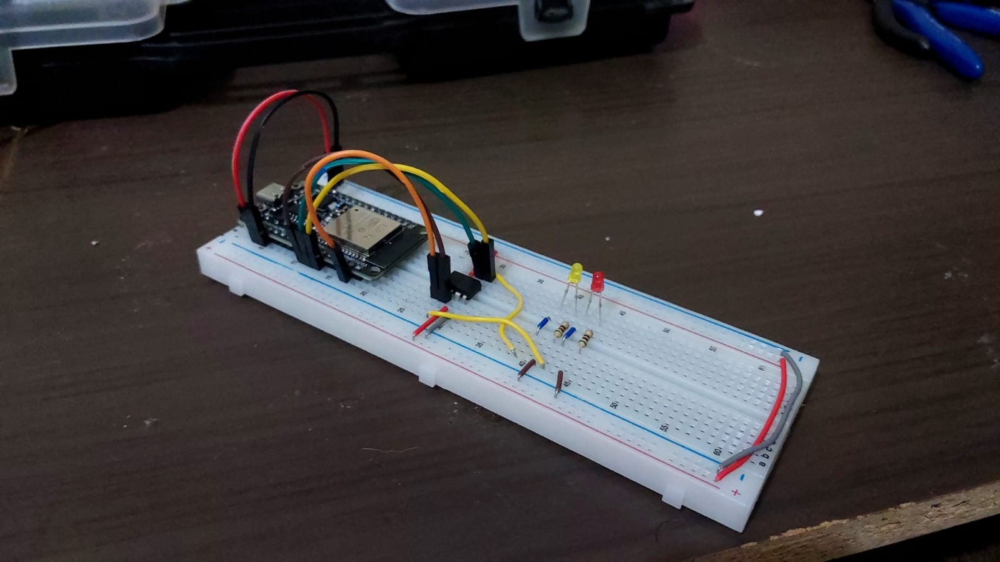
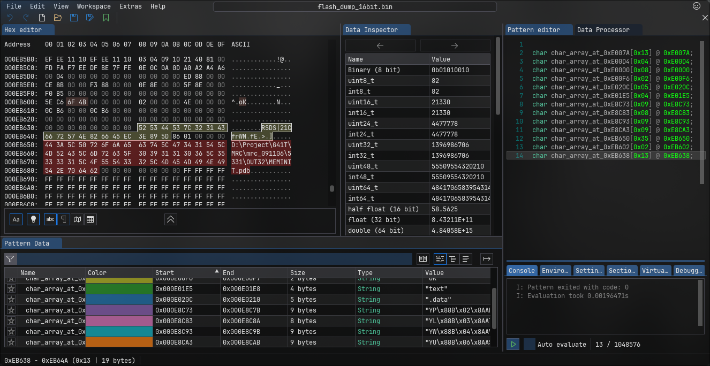

# Motherboard Firmware Extraction & Analysis

---

## 📌 Project Overview

This project focuses on extracting and analyzing SPI flash memory from a motherboard using an ESP32-based reader.

The goal is to obtain raw firmware data, study its internal structure, and identify patterns such as headers, repeating regions, and possible firmware components. The project combines low-level hardware interfacing with data analysis techniques to better understand how embedded systems store and organize information.

*Figure 1: ESP32 Hardware interface for Out-of-Band SPI extraction.*

---

## 🧠 Technical Deep Dive

### Hardware Interfacing

The system utilizes the **ESP-IDF SPI Master driver** to communicate with Flash chips. We obtain an unaltered bit-for-bit image of the firmware.

### Structural Discovery

Our analysis of the raw dump revealed several critical artifacts:

* **Legacy Headers:** Detected `AMIBIOS`, `AMIJPG`, and `AMIBOOT` signatures, identifying the vendor as American Megatrends.
* **Executable Recovery:** Identified and extracted a valid **PE (Portable Executable)** file embedded within the ROM.
* **Signature Logic:** Discovered heuristic code that scans for the `AMIBIOS` signature and implements a 2048-bit (256-byte) pointer decrement upon a match, likely used for memory alignment.

---

## 📊 Analysis Pipeline

1. **Extraction:** ESP32 dumps SPI Flash via bit-banging or hardware SPI.
2. **Ingestion:** Binary data is processed through ImHex.
3. **Deconstruction:** identification of `MZ` (DOS) and `PE` (Windows/UEFI) headers.
4. **Reverse Engineering:** Code analysis using **Cutter** to map initialization vectors and jump tables.

*Figure 2: Identifying memory offsets and signature patterns in ImHex.*

---

## 🛠️ Tech Stack

* **Firmware:** C (ESP-IDF) for high-performance SPI throughput.
* **Analysis Tools:**
    * **ImHex:** For hexadecimal structural visualization and pattern tagging.
    * **Cutter/Rizin:** For x86 (16/32-bit) disassembly and decompilation.

---

## 🔍 Key Findings

> [!IMPORTANT]
> **Signature-Based Navigation:** The firmware contains a specific routine that validates the `AMIBIOS` string. If found, the system performs a memory-offset adjustment (decrementing 2048 bits). This suggests the firmware uses a fixed-offset look-up table based on signature discovery rather than a standard file system.

*Figure 3: Signature check code in Cutter.*

---

## 🚀 Future Roadmap

- [ ] Analyze firmware data regions and micro codes.

---

## ⚠️ Disclaimer

This project is strictly for educational purposes and security research. Unauthorized access to hardware or firmware may void warranties or violate terms of service.

---
